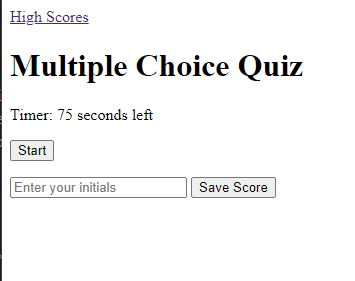
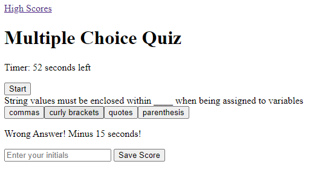
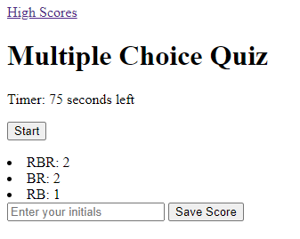

# Multi-choice Quiz

## Description

Javascript focused project involving event listeners, getter/setters, objects, local storage and timers.

## Table of Contents

- [Example](#example)

## Example

Application Page Deployment: https://r-basu.github.io/multichoice-quiz

